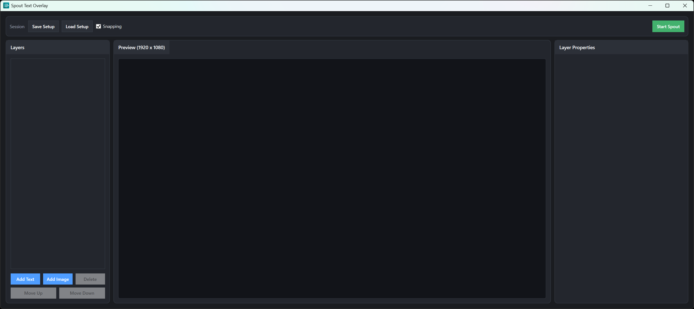

<p align="center">
  
</p>

# Simple Spout Overlay

Simple Spout Overlay is a Windows desktop app for building transparent overlays and sending them directly to Spout in real time.

<p align="center">
  
</p>

## What You Can Do

- Build overlays with both **text layers** and **image layers**
- See a live `1920x1080` preview that matches the Spout output
- Drag layers directly in the preview to position them visually
- Use optional edge/center **snapping** while dragging for cleaner alignment
- Reorder layers with drag-and-drop, or `Move Up` / `Move Down`
- Edit per-layer properties (text, font, colors, outline, position, scale, image source)
- Undo/redo layer edits, including slider changes as a single undo step per drag
- Save and load setups as JSON files
- Auto-load your last default session on startup and auto-save on close

## Quick Start

### Recommended: Download from GitHub Releases

The easiest way to get started is to download the latest version from [Releases](https://github.com/haruyuki/SimpleSpoutOverlay/releases).

### Alternative: Build from source

Requirements:

- Windows 10/11 x64
- .NET 8 SDK

From the repository root:

```powershell
dotnet restore
dotnet build .\SimpleSpoutOverlay\SimpleSpoutOverlay.csproj -c Release
```

Release binaries will be generated under:

`SimpleSpoutOverlay\bin\Release\net8.0-windows\`

Optional: run directly from source during development:

```powershell
dotnet run --project .\SimpleSpoutOverlay\SimpleSpoutOverlay.csproj -c Release
```

## Keyboard Shortcuts

- `Ctrl+Z` - Undo
- `Ctrl+Y` - Redo
- `Ctrl+S` - Save setup
- `Ctrl+O` - Load setup
- `Ctrl+N` - Add text layer
- `Ctrl+Delete` - Delete selected layer
- `Ctrl+Up` - Move selected layer up (when the layer list is focused)
- `Ctrl+Down` - Move selected layer down (when the layer list is focused)

## Setup Files and Persistence

- Save/load setup files manually with the Session buttons (`.json`).
- Default auto-save session path: `%AppData%\SimpleSpoutOverlay\session.json`
- The app also remembers your last manual setup folder for faster save/load dialogs.

## Spout Notes

- The top-right button changes state between `Start Spout` and `Spout Active`.
- If your receiver does not see the stream, restart Spout from the app and reselect `SimpleSpoutOverlay` in the receiver.

